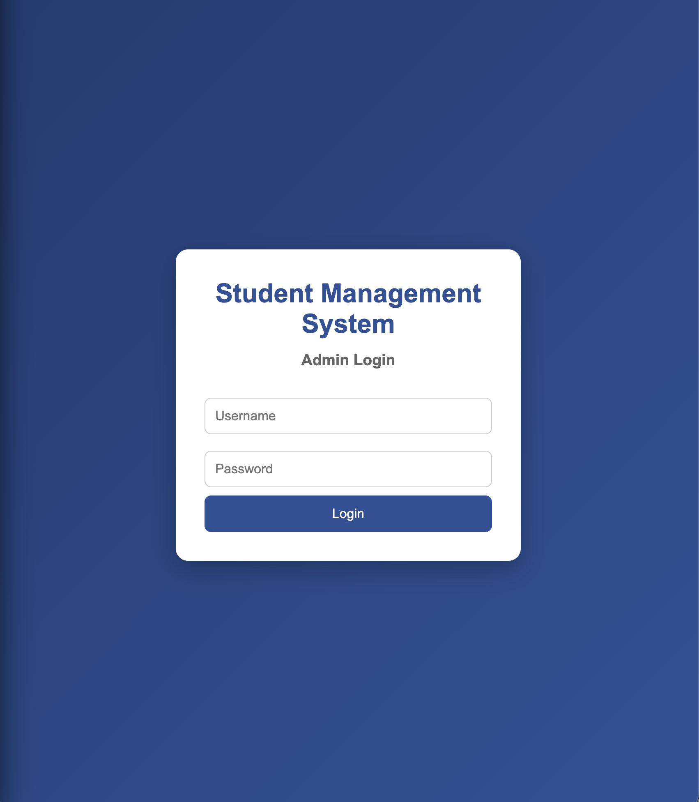
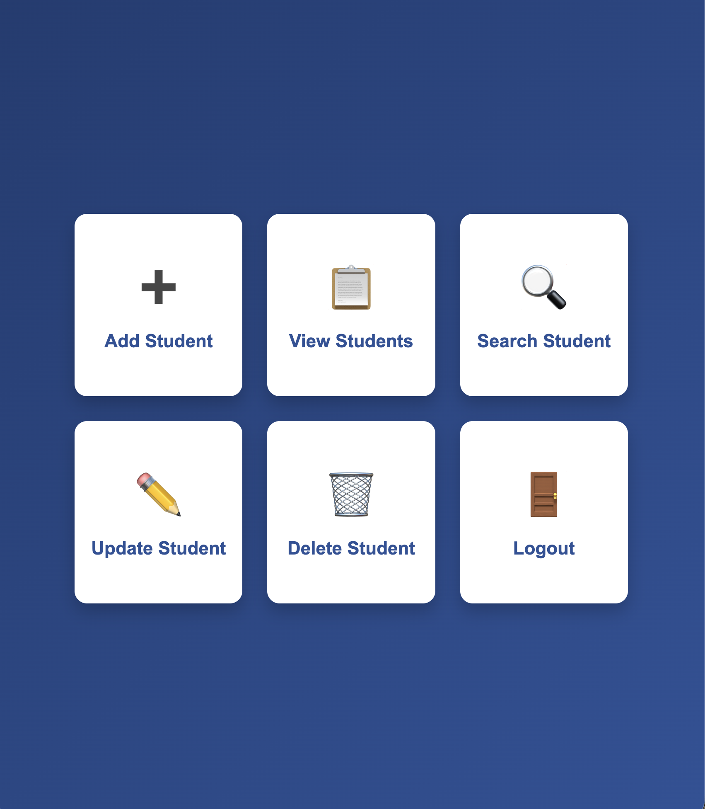
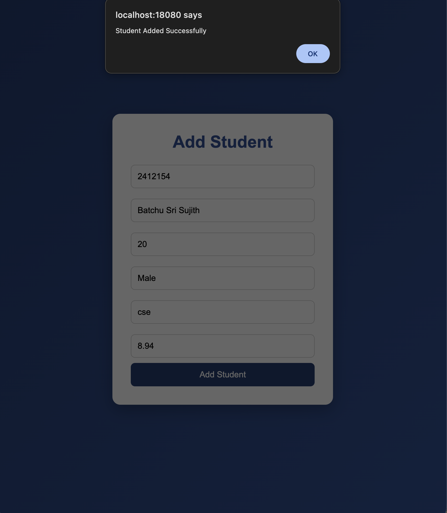
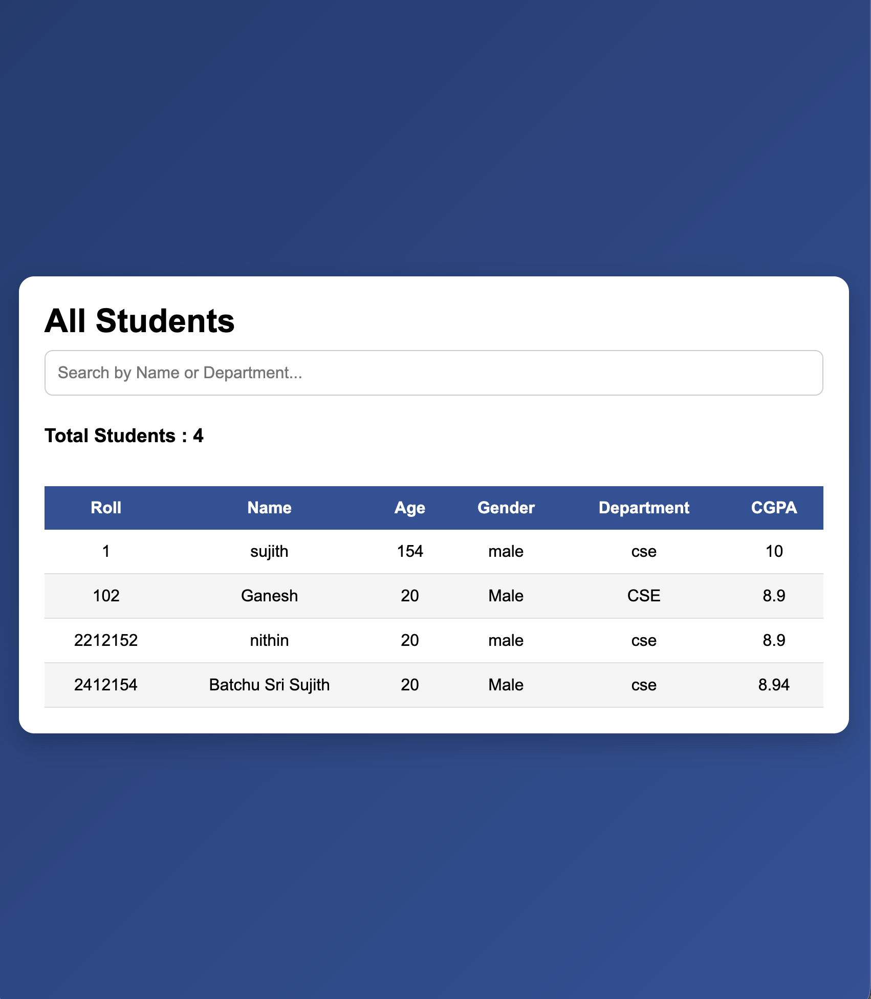
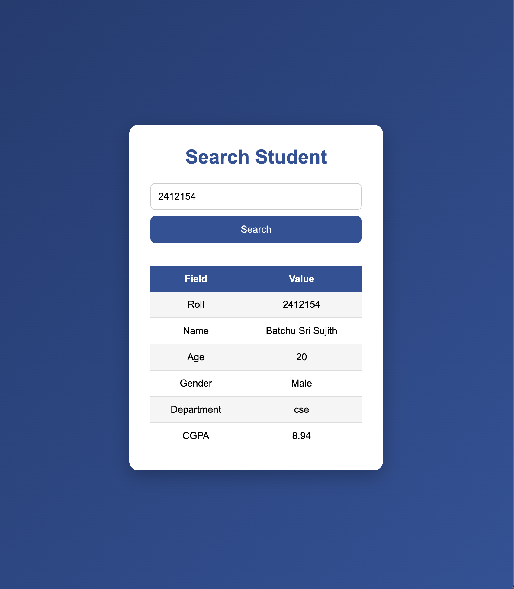
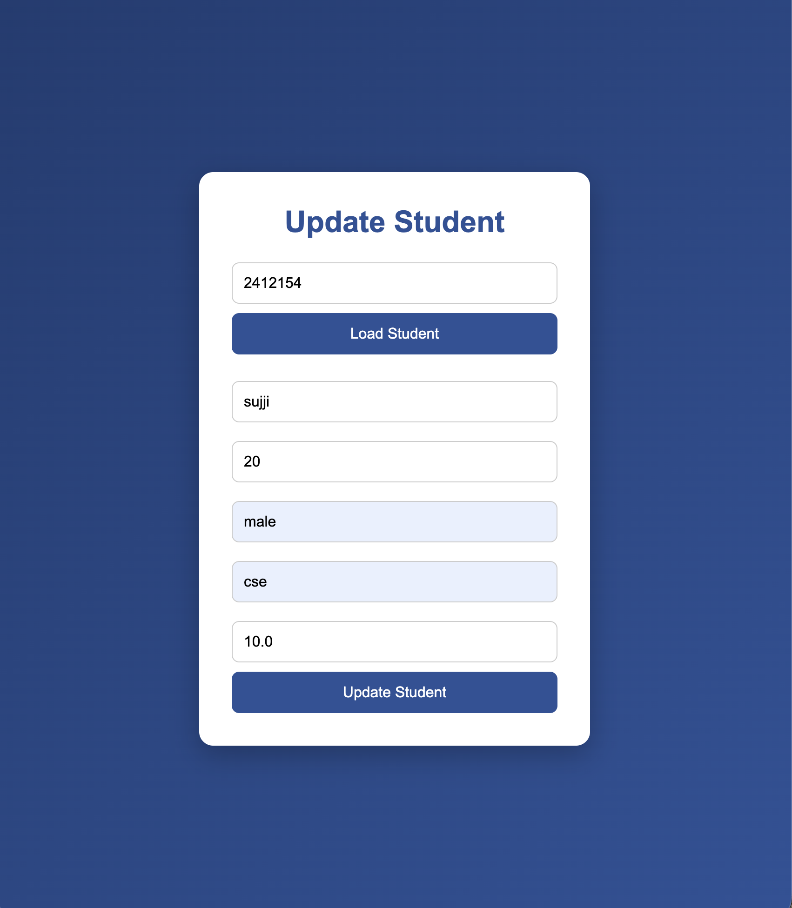
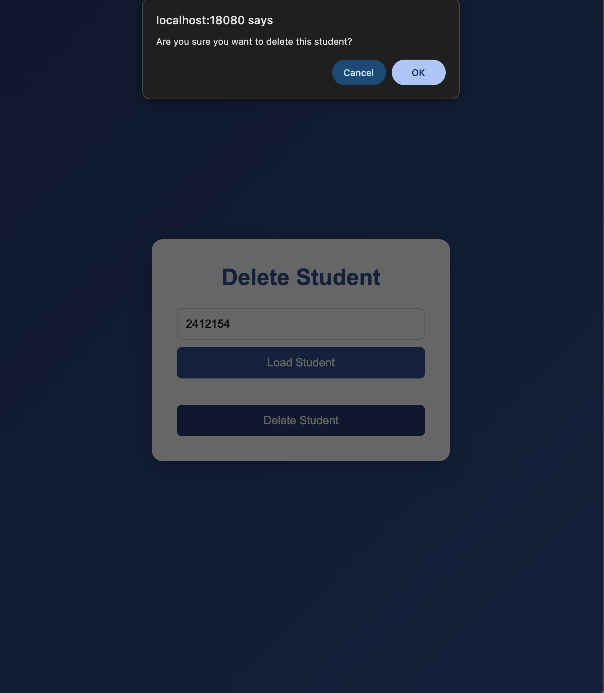

# 🎓 Student Management System

A modern **Student Management System** built using **C++**, **Crow Framework**, **SQLite**, **HTML**, **CSS**, **JavaScript**, and **CMake**. The application provides a clean web interface for managing student records with secure database storage.

---

## 🚀 Features

### 🔐 Authentication
- Admin Login
- Username & Password Verification
- Secure Login System

### 👨‍🎓 Student Management
- ➕ Add Student
- 📋 View Students
- 🔍 Search Student
- ✏️ Update Student
- 🗑️ Delete Student

### 💾 Database
- SQLite Database Integration
- Permanent Data Storage
- Automatic Table Creation
- Prepared SQL Statements

### 🌐 Modern Web Interface
- Responsive Dashboard
- Professional UI
- Responsive Forms
- Search & Update Layout
- Delete Confirmation
- Dashboard Navigation

### 📊 Reports *(Under Development)*
- Total Students
- Average CGPA
- Highest CGPA
- Department-wise Statistics

---

# 🛠️ Technologies Used

## Backend
- C++
- Crow Framework
- SQLite3
- CMake

## Frontend
- HTML5
- CSS3
- JavaScript

## Programming Concepts
- Object-Oriented Programming
- REST API
- JSON Handling
- Modular Programming

---

# 📂 Project Structure

```
StudentManagementSystem/
│
├── include/
│   ├── Database.h
│   ├── LoginManager.h
│   ├── Person.h
│   ├── Routes.h
│   ├── Student.h
│   └── StudentManager.h
│
├── src/
│   ├── Database.cpp
│   ├── LoginManager.cpp
│   ├── Person.cpp
│   ├── Routes.cpp
│   ├── Student.cpp
│   ├── StudentManager.cpp
│   └── web_main.cpp
│
├── templates/
│   ├── login.html
│   ├── dashboard.html
│   ├── addStudent.html
│   ├── viewStudents.html
│   ├── searchStudent.html
│   ├── updateStudent.html
│   ├── deleteStudent.html
│   └── reports.html
│
├── static/
│   ├── css/
│   │   └── style.css
│   └── js/
│       └── app.js
│
├── students.db
├── CMakeLists.txt
└── README.md
```

---

# 🏗️ System Architecture

```
Browser
      │
      ▼
HTML • CSS • JavaScript
      │
      ▼
Crow Framework (C++)
      │
      ▼
Database Layer
      │
      ▼
SQLite Database
```

---

# 📚 OOP Concepts Used

### ✅ Encapsulation
- Database Class
- Student Class
- LoginManager
- StudentManager

### ✅ Inheritance
- `Student` inherits from `Person`

### ✅ Abstraction
- Database operations are hidden inside the Database class.

### ✅ Polymorphism
- Virtual destructor in the Person class.

### ✅ Modular Programming
- Separate Header Files
- Separate Source Files
- Dedicated Route Management

---

# 💾 Student Information

Each student record contains:

- Roll Number
- Name
- Age
- Gender
- Department
- CGPA

---

# 🚀 How to Build

```bash
mkdir build

cd build

cmake ..

cmake --build .
```

---

# ▶️ Run

```bash
./StudentManagementSystem
```

Open your browser:

```
http://localhost:18080
```

---

# 🔑 Default Login

| Username | Password |
|----------|----------|
| admin | admin123 |

---

# 🎥 Project Demo

Watch the complete demonstration of the **Student Management System** on LinkedIn.

[](https://www.linkedin.com/posts/batchu-sri-sujith-46a6b0341_excited-to-share-a-demo-of-my-student-management-ugcPost-7477770582571270144-zMiL/?utm_source=share&utm_medium=member_desktop&rcm=ACoAAFW11ZIBfnFIHVe4rt_mBmr9LMnVsH8uIYk)

> 💡 **Click the image above to watch the complete project demo.**

### Demo Highlights

- 🔐 Admin Login
- ➕ Add Student
- 📋 View Students
- 🔍 Search Student
- ✏️ Update Student
- 🗑️ Delete Student
- 💾 SQLite Database Integration
- 🌐 Responsive Web Interface

---

# 📸 Screenshots

# 📸 Screenshots

## Login Page


---

## Dashboard



---

## Add Student



---

## View Students



---

## Search Student



---

## Update Student



---

## Delete Student



---

# 🎯 Learning Outcomes

This project demonstrates:

- Object-Oriented Programming
- C++ Web Development
- Crow Framework
- SQLite Database
- REST API Development
- CRUD Operations
- HTML
- CSS
- JavaScript
- CMake Build System
- Responsive UI Design
- Database Connectivity
- MVC-style Project Structure

---

# 🔮 Future Improvements

- Session-Based Authentication
- Dashboard Analytics
- Student Image Upload
- Attendance Management
- Department Management
- Export to CSV/PDF
- Pagination
- Search Filters
- Role-Based Access

---

# 👨‍💻 Author

**Sujith Batchu**

B.Tech – Computer Science & Engineering

National Institute of Technology Silchar

---

# 📄 License

This project is developed for educational and learning purposes.
This project is developed for educational and learning purposes.
